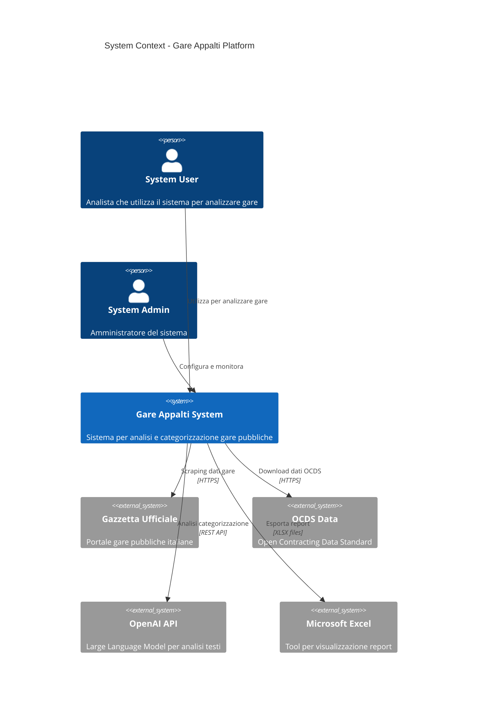
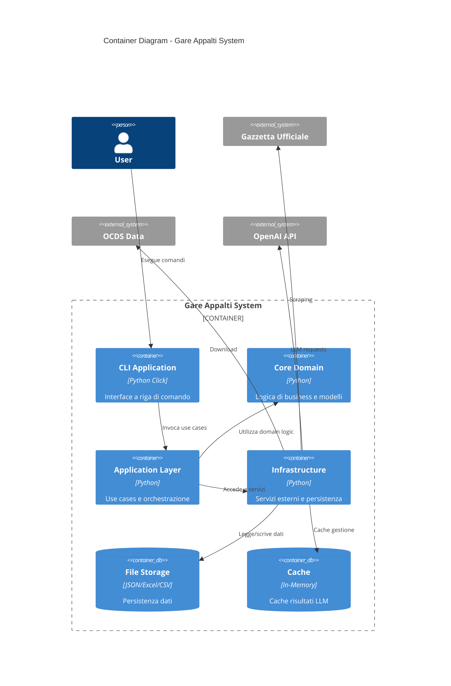
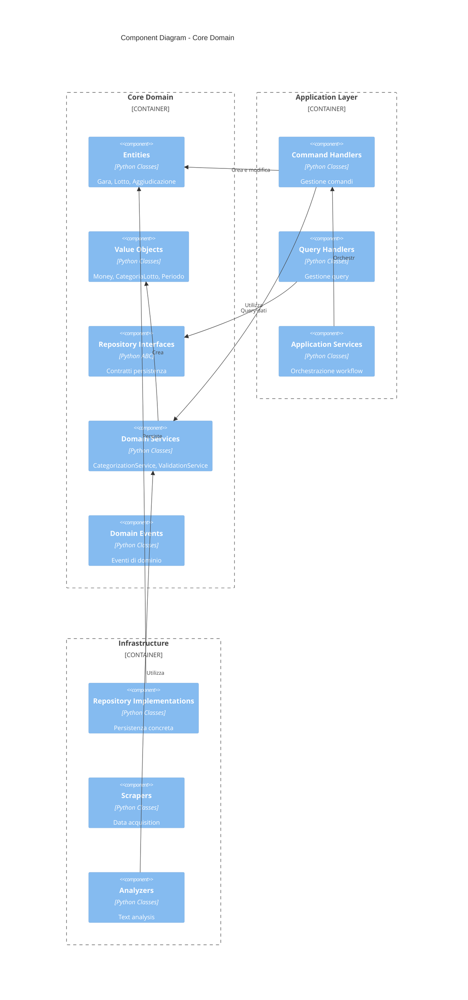
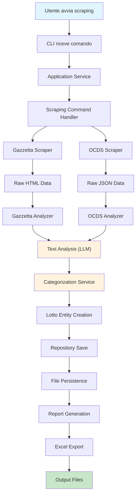
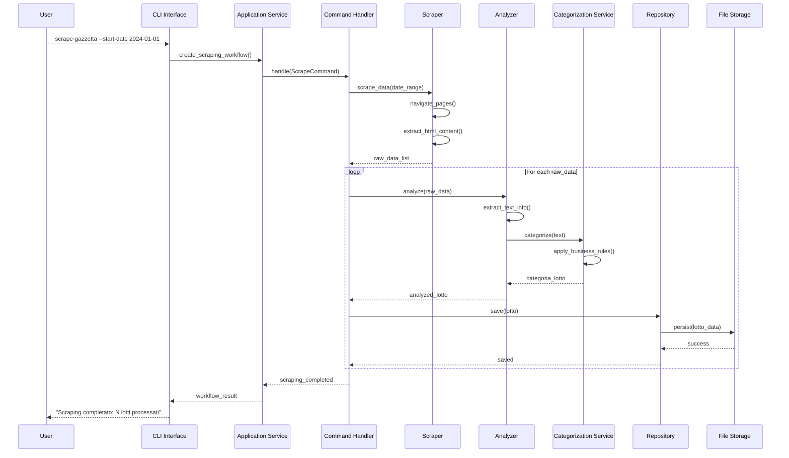
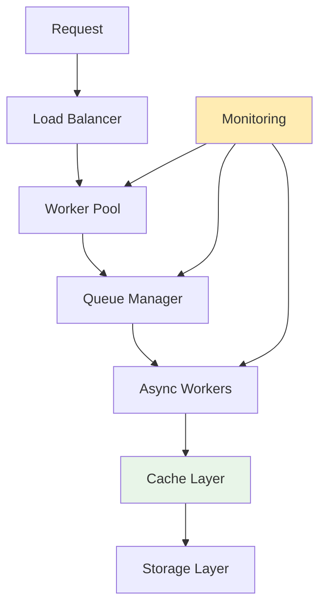

# System Architecture Diagrams - Gare Appalti

## C4 Model - System Context



## C4 Model - Container Diagram



## C4 Model - Component Diagram (Core Domain)



## Deployment Diagram

```mermaid
deployment
    title Deployment Architecture
    
    node "Development Machine" {
        component "Python 3.11+" as python
        component "CLI Application" as cli
        database "Local File System" as files {
            folder "data/" as data_folder
            folder "logs/" as logs_folder
            folder "checkpoints/" as checkpoints
        }
    }
    
    cloud "External Services" {
        component "Gazzetta Ufficiale" as gazzetta
        component "OCDS Portal" as ocds  
        component "OpenAI API" as openai_api
    }
    
    cli --> python
    python --> files
    python --> gazzetta : HTTPS/Selenium
    python --> ocds : HTTPS/requests
    python --> openai_api : HTTPS/REST
```

## Data Flow Diagram



## Sequence Diagram - Scraping Workflow



## Class Diagram - Core Entities

```mermaid
classDiagram
    class Gara {
        -GaraId id
        -string titolo
        -Ente ente
        -List~Lotto~ lotti
        -StatoGara stato
        -List~DomainEvent~ events
        +aggiungi_lotto(Lotto)
        +pubblica()
        +get_importo_totale() Money
    }
    
    class Lotto {
        -LottoId id
        -string oggetto
        -Money importo
        -CategoriaLotto categoria
        -Aggiudicazione aggiudicazione
        +categorizza(CategoriaLotto)
        +aggiudica(Aggiudicazione)
        +is_categorized() bool
    }
    
    class Money {
        -Decimal amount
        -Currency currency
        +add(Money) Money
        +subtract(Money) Money
        +multiply(int) Money
        +is_zero() bool
    }
    
    class CategoriaLotto {
        -TipoCategoria categoria_principale
        -List~string~ sottocategorie
        -float confidence
        +is_illuminazione() bool
        +is_energia() bool
        +has_alta_confidence() bool
    }
    
    class Periodo {
        -datetime inizio
        -datetime fine
        +contiene(datetime) bool
        +durata_giorni() int
        +overlap(Periodo) bool
    }
    
    class Aggiudicazione {
        -AggiudicazioneId id
        -string impresa
        -Money importo_aggiudicazione
        -datetime data_aggiudicazione
        +is_valida() bool
    }
    
    Gara ||--o{ Lotto : contains
    Lotto ||--|| Money : has
    Lotto ||--o| CategoriaLotto : categorized_as
    Lotto ||--o| Aggiudicazione : awarded_to
    Gara ||--|| Periodo : valid_in
```

## Architecture Decision Records (ADRs)

### ADR-001: Clean Architecture with DDD

**Status**: Accepted

**Context**: Il sistema attuale ha problemi di manutenibilità dovuti a:
- Logica di business sparsa
- Dipendenze circolari
- Test difficili da scrivere
- Codice duplicato

**Decision**: Adottare Clean Architecture con Domain-Driven Design

**Consequences**:
- **Positive**: Separazione chiara responsabilità, testabilità, manutenibilità
- **Negative**: Maggiore complessità iniziale, più file da gestire
- **Neutral**: Necessità di formazione team su DDD

### ADR-002: File-Based Persistence

**Status**: Accepted

**Context**: Il sistema attuale utilizza file JSON/Excel per persistenza

**Decision**: Mantenere file-based storage con repository pattern

**Consequences**:
- **Positive**: Semplicità, no database setup, portabilità
- **Negative**: Performance limitate, no transazioni ACID
- **Neutral**: Possibilità futura migrazione a DB

### ADR-003: Command Query Responsibility Segregation (CQRS)

**Status**: Accepted

**Context**: Il sistema ha pattern di lettura e scrittura differenti

**Decision**: Separare command handlers da query handlers

**Consequences**:
- **Positive**: Ottimizzazione separata read/write, scalabilità
- **Negative**: Maggiore complessità implementazione
- **Neutral**: Preparazione per future ottimizzazioni

### ADR-004: Dependency Injection Container

**Status**: Accepted

**Context**: Gestione dipendenze complesse tra layer

**Decision**: Utilizzare dependency-injector library

**Consequences**:
- **Positive**: Loose coupling, testabilità, configurabilità
- **Negative**: Learning curve, setup iniziale
- **Neutral**: Standard industry practice

## Performance Considerations

### Bottleneck Analysis

1. **LLM API Calls**
   - **Issue**: Latenza alta, rate limiting
   - **Solution**: Caching, batch processing, async calls
   - **Metrics**: Response time, tokens/minute

2. **Web Scraping**
   - **Issue**: Network latency, anti-bot protection
   - **Solution**: Respectful delays, session management
   - **Metrics**: Pages/minute, success rate

3. **File I/O Operations**
   - **Issue**: Large datasets, frequent writes
   - **Solution**: Batch writes, compression, async I/O
   - **Metrics**: MB/s throughput, IOPS

### Scalability Patterns



### Memory Management

- **Strategy**: Lazy loading, streaming processing
- **Patterns**: Generator functions, context managers
- **Monitoring**: Memory profiling, garbage collection metrics
- **Limits**: Max 4GB RAM usage, auto-cleanup after batch

## Security Considerations

### Data Protection
- **Encryption**: Sensitive config in environment variables
- **Access Control**: File permissions, API key rotation
- **Audit Trail**: Operation logging, error tracking
- **Privacy**: No PII storage, anonymized logs

### External Service Security
- **API Keys**: Secure storage, rotation schedule
- **Rate Limiting**: Respect service limits, exponential backoff
- **Input Validation**: Sanitize scraped data, validate configs
- **Network Security**: HTTPS only, certificate validation

## Monitoring and Observability

### Metrics Collection
```python
class MetricsCollector:
    def track_scraping_session(self, session: ScrapingSession):
        # Durata sessione
        # Items processati
        # Errori incontrati
        # Bandwidth utilizzo
        pass
    
    def track_llm_usage(self, request: LLMRequest, response: LLMResponse):
        # Tokens utilizzati
        # Latenza request
        # Costo request
        # Success rate
        pass
```

### Health Checks
```python
class HealthChecker:
    def check_external_services(self) -> HealthStatus:
        # Gazzetta availability
        # OCDS endpoint status  
        # OpenAI API status
        # File system space
        pass
```

### Alerting Rules
- **Error Rate**: > 5% in 10 minutes
- **Response Time**: > 30s average
- **Disk Space**: < 10% available
- **API Quota**: > 80% utilized

Questa documentazione architettural fornisce una visione completa del sistema, dalle decisioni di alto livello ai dettagli implementativi, garantendo che tutti gli stakeholder abbiano una comprensione chiara della struttura e dei principi guida del nuovo sistema.